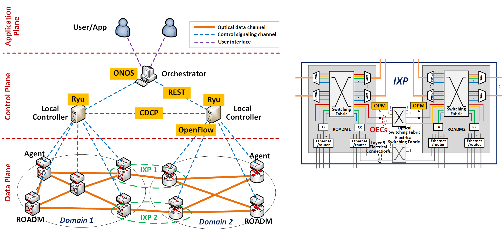

# Why tSDX?

A transparent software-defined exchange (tSDX) uses Optical Express Connections (OECs) at the Internet exchange points (IXPs) to pass signals through entirely in the optical layer without digital processing. This avoids the electronic delays and high cost and energy of repeated processing in line and client transceivers, routers, and switches peering at each IXP. Keeping signals in the optical domain also provides a layer of security and privacy as the data is not processed in the digital domain.

# Control architecture 

This is an SDN-based hierarchical control architecture:

- Orchestrator: a global coordinator with unified resource abstraction provided to higher layer applications and users over its northbound API.

- Local Controller: autonomous domain controller with the capabilities of intra-domain resource management, path computation, connection control and OSNR monitoring.

- Agent: a device-specified element with protocol resolution and physical layer element operational control capabilities.

# Key techology

- Inter-domain control capability:

New control mechanisms are required to implement inter-domain wavelength routing path computation/optimization and provisioning, and impairment-aware reactions and negotiations between domains based on OPM and alien wavelength performance requirements, while preserving domain autonomy and concealment. 

- Real-time signal quality monitoring mechanism:

Because optical signals are transparently exchanged, forward error correction (FEC) and associated O-E-O conversion performance monitoring are no longer available, therefore new signal quality monitoring mechanisms are needed to guarantee SLAs. Recently, in-band, real-time optical performance monitoring (OPM) methods have been developed on integrated photonic platforms that can provide affordable, per-channel, continuous optical-layer performance guarantees.

# Collaborators:

- The University of Arizona
- Columbia University
- Dublin City University

